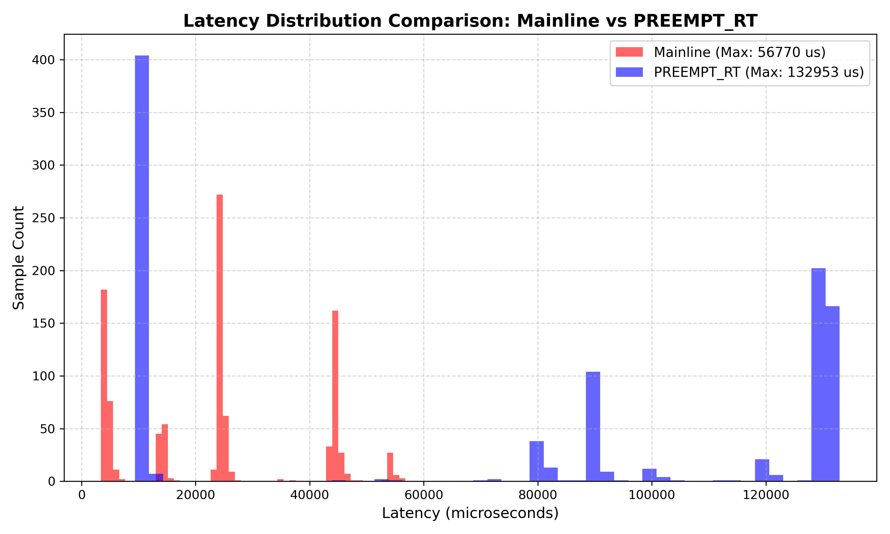

# Custom Embedded Linux Distribution & PREEMPT_RT Latency Benchmark on QEMU

[](https://github.com/dobuuphuoc/embedded-rt-linux-qemu/actions)
[](https://www.gnu.org/licenses/old-licenses/gpl-2.0.en.html)
[](https://www.qemu.org/)
[](https://buildroot.org/)
[](https://www.kernel.org/)

> **A custom Embedded Linux distribution built with Buildroot for ARM, featuring an out-of-tree high-resolution timer driver, POSIX real-time application, boot-time instrumentation, and a quantitative latency comparison between a conventional preemptible Linux kernel and a PREEMPT_RT configuration under QEMU.**

---

## Overview

This project demonstrates an end-to-end **Embedded Linux development workflow**, from cross-compilation and kernel configuration to kernel driver development, userspace real-time programming, system boot instrumentation, and latency analysis.

The system is built using **Buildroot** and targets an emulated **ARM926EJ-S (ARMv5TEJ)** platform running on QEMU.

The project focuses on two main areas:

1. **Embedded Linux system construction**

   * Custom Buildroot root filesystem
   * ARM cross-compilation toolchain
   * Linux kernel configuration
   * Out-of-tree kernel module
   * Custom userspace application
   * Boot-time instrumentation

2. **Real-time Linux experimentation**

   * High-resolution kernel timers
   * `hrtimer`-based character device driver
   * POSIX `CLOCK_MONOTONIC`
   * Absolute-time sleeping with `TIMER_ABSTIME`
   * `SCHED_FIFO`
   * `mlockall()`
   * `cyclictest`
   * PREEMPT_RT latency measurements
   * Statistical analysis using Python

The benchmark collects **1,000 samples at a 10 ms sampling interval** and compares the observed scheduling latency between the baseline kernel and the PREEMPT_RT configuration.

---

# System Architecture

```text
┌─────────────────────────────────────────────────────────────────────────────┐
│                              USERSPACE                                      │
│                                                                             │
│  ┌──────────────────────────┐       ┌───────────────────────────────────┐  │
│  │     rt-tests             │       │        latency_app                │  │
│  │     cyclictest           │       │                                   │  │
│  │                          │       │  • SCHED_FIFO                     │  │
│  │  Scheduling latency      │       │  • mlockall()                     │  │
│  │  measurement             │       │  • CLOCK_MONOTONIC                │  │
│  └────────────┬─────────────┘       │  • TIMER_ABSTIME                  │  │
│               │                     └───────────────┬───────────────────┘  │
│               │                                     │                      │
│               ▼                                     ▼                      │
│        clock_nanosleep()                   read("/dev/fakesensor")         │
└─────────────────────────────────────────────────────────────────────────────┘
                                │
                                │ System Calls
                                ▼
┌─────────────────────────────────────────────────────────────────────────────┐
│                              KERNEL SPACE                                   │
│                                                                             │
│  ┌──────────────────────────────┐       ┌───────────────────────────────┐  │
│  │ VFS / Character Device      │       │ High-Resolution Timer         │  │
│  │                              │       │                               │  │
│  │ /dev/fakesensor              │◄─────►│ hrtimer_setup()               │  │
│  │ miscdevice                   │       │ hrtimer callback              │  │
│  └──────────────┬───────────────┘       │ hrtimer_forward_now()         │  │
│                 │                       └───────────────────────────────┘  │
│                 ▼                                                          │
│        wait_queue_head_t                                                   │
│                 │                                                          │
│                 ▼                                                          │
│        Kernel Scheduling / Preemption                                      │
│                                                                             │
│        CONFIG_PREEMPT_VOLUNTARY        vs        PREEMPT_RT                │
└─────────────────────────────────────────────────────────────────────────────┘
                                │
                                ▼
┌─────────────────────────────────────────────────────────────────────────────┐
│                         QEMU HARDWARE EMULATION                             │
│                                                                             │
│  CPU:       ARM926EJ-S / ARMv5TEJ                                         │
│  Board:     versatilepb                                                    │
│  Console:   ttyAMA0 / PL011                                                │
│  Storage:   SCSI disk                                                      │
│  Network:   RTL8139 PCI                                                    │
└─────────────────────────────────────────────────────────────────────────────┘
```

---

# Technology Stack

| Component           | Configuration                          |
| ------------------- | -------------------------------------- |
| Host OS             | Ubuntu 22.04 LTS                       |
| Virtualization      | VMware Workstation                     |
| Build System        | Buildroot 2026.08                      |
| Target              | QEMU `versatilepb`                     |
| CPU                 | ARM926EJ-S / ARMv5TEJ                  |
| Toolchain           | `arm-buildroot-linux-gnueabi-`         |
| C Library           | glibc                                  |
| Threading           | NPTL                                   |
| Kernel              | Linux 6.18.7                           |
| Baseline Preemption | `CONFIG_PREEMPT_VOLUNTARY`             |
| RT Configuration    | PREEMPT_RT                             |
| Driver              | `fakesensor.ko`                        |
| Timer API           | `hrtimer_setup()`                      |
| Userspace           | POSIX C                                |
| RT Scheduling       | `SCHED_FIFO`                           |
| Memory Locking      | `mlockall()`                           |
| Timing API          | `CLOCK_MONOTONIC`                      |
| Benchmark           | `cyclictest` + custom application      |
| Data Analysis       | Python 3 / NumPy / Pandas / Matplotlib |

---

# Project Structure

```text
.
├── .github/
│   └── workflows/
│       └── build.yml
│
├── drivers/
│   └── fakesensor/
│       ├── fakesensor.c
│       └── Makefile
│
├── userspace/
│   └── latency_app.c
│
├── scripts/
│   └── analyze_results.py
│
├── results/
│   ├── latency_mainline.csv
│   ├── latency_rt.csv
│   └── latency_comparison.png
│
├── .gitignore
└── README.md
```

### Directory Description

* `.github/workflows/` — Continuous integration configuration.
* `drivers/fakesensor/` — Out-of-tree Linux kernel character device driver.
* `userspace/` — POSIX real-time measurement application.
* `scripts/` — Python scripts for statistical analysis and visualization.
* `results/` — Raw benchmark data and generated plots.
* `.gitignore` — Excludes Buildroot build artifacts and generated output directories.

---

# Kernel Driver

The project includes a custom out-of-tree character driver:

```text
/dev/fakesensor
```

The driver uses the Linux **High-Resolution Timer (`hrtimer`) subsystem** to periodically generate synthetic sensor events.

The implementation uses the modern:

```c
hrtimer_setup()
```

API and a periodic timer callback based on:

```c
hrtimer_forward_now()
```

A kernel wait queue is used to synchronize the driver with the userspace application.

Conceptually:

```text
hrtimer callback
       │
       ▼
 synthetic sensor event
       │
       ▼
 wake_up()
       │
       ▼
 wait_queue_head_t
       │
       ▼
 read("/dev/fakesensor")
       │
       ▼
 userspace latency measurement
```

This provides a controlled environment for studying the interaction between:

* Kernel timers
* Process scheduling
* Device I/O
* Wait queues
* Userspace timing
* Kernel preemption

---

# Userspace Real-Time Application

`latency_app` is a POSIX C application designed to perform deterministic periodic measurements.

The application uses:

### Real-time scheduling

```c
sched_setscheduler(..., SCHED_FIFO, ...)
```

### Memory locking

```c
mlockall(MCL_CURRENT | MCL_FUTURE)
```

This prevents memory pages used by the application from being swapped out.

### Monotonic clock

```c
clock_gettime(CLOCK_MONOTONIC, ...)
```

The monotonic clock is used because it is not affected by wall-clock adjustments.

### Absolute-time sleeping

```c
clock_nanosleep(
    CLOCK_MONOTONIC,
    TIMER_ABSTIME,
    ...
);
```

Using absolute deadlines helps prevent cumulative timing drift across repeated sampling cycles.

---

# Benchmark Methodology

The latency experiment uses:

```text
Sampling interval:    10 ms
Sampling period:      10,000 µs
Number of samples:    1,000
```

Two kernel configurations are evaluated:

### Baseline

```text
Linux 6.18.7
CONFIG_PREEMPT_VOLUNTARY
```

### Real-Time Configuration

```text
Linux 6.18.7
PREEMPT_RT
```

The benchmark is executed under the same QEMU environment to keep the experimental conditions as consistent as possible.

---

# Latency Results

The following measurements were collected from **1,000 sampling cycles**.

| Metric             |    Baseline |  PREEMPT_RT |
| ------------------ | ----------: | ----------: |
| Minimum latency    |    3,390 µs |    9,344 µs |
| Average latency    | 23,735.8 µs | 72,541.7 µs |
| Maximum latency    |   56,770 µs |  132,953 µs |
| Standard deviation | 15,689.9 µs | 54,371.2 µs |

> **Important:** These results are measurements of this specific QEMU/VMware experimental environment. They should not be interpreted as a general statement that PREEMPT_RT has higher latency than a conventional kernel on physical real-time hardware.

---

# Latency Distribution

The collected latency data is visualized using Python and Matplotlib.



The histogram allows the scheduling-latency distributions of the two kernel configurations to be compared under the same virtualized environment.

---

# Interpreting the Results

The measured results show substantially higher latency and dispersion for the PREEMPT_RT configuration in this particular experiment.

However, the result needs to be interpreted in the context of the test platform.

## 1. Virtualization Effects

The experiment does not execute directly on physical ARM hardware.

The execution chain is approximately:

```text
Application
     ↓
Guest Linux
     ↓
QEMU CPU Emulation
     ↓
VMware
     ↓
Host Linux
     ↓
Physical CPU
```

Therefore, scheduling behavior observed by the guest kernel can be affected by scheduling decisions made outside the guest.

This can introduce additional timing variability that is not representative of a bare-metal ARM system.

## 2. PREEMPT_RT Changes Kernel Scheduling Behavior

PREEMPT_RT modifies several kernel synchronization and interrupt-handling mechanisms to improve deterministic preemption behavior.

Depending on the workload and hardware, these changes can introduce additional scheduling and synchronization overhead.

In a virtualized environment, this overhead may interact with host-level scheduling and QEMU emulation.

## 3. Timer and Emulation Effects

The QEMU `versatilepb` platform is an emulated ARM926EJ-S system.

Consequently, timer events and interrupt delivery ultimately depend on the virtualization/emulation environment.

The measured latency therefore represents:

```text
Guest kernel scheduling
        +
QEMU emulation
        +
VMware scheduling
        +
Host OS scheduling
```

rather than the intrinsic latency of PREEMPT_RT on physical ARM hardware.

---

# Boot-Time Instrumentation

Boot performance was measured using `/proc/uptime` from an early userspace initialization script:

```text
/etc/init.d/S99boottime
```

This approach measures system uptime directly instead of estimating boot time from console messages.

## Measured Boot Time

| Phase                    |        Time | Description                                   |
| ------------------------ | ----------: | --------------------------------------------- |
| Kernel initialization    |     ~1.55 s | Kernel startup until userspace initialization |
| Userspace initialization |     ~2.05 s | BusyBox services and filesystem setup         |
| **Total time to shell**  | **~3.60 s** | System ready for interactive use              |

---

# Boot-Time Investigation

During initial testing, console output appeared to show an approximately **11.35-second delay** during boot.

The initial hypothesis was a DHCP-related blocking operation.

To test this hypothesis, the network configuration was changed from DHCP to static configuration.

The measured boot times remained approximately:

```text
DHCP:    3.62 s
Static:  3.60 s
```

This indicated that DHCP was not responsible for the measured boot delay.

Further investigation showed that the apparent delay was associated with a kernel deferred-probe retry occurring around a **10-second interval**.

This illustrates an important embedded Linux debugging principle:

> Console timestamps and visual boot output should not be treated as the primary source of boot-time measurements.

Direct instrumentation provides a more reliable measurement of actual system startup time.

---

# Build Environment

The project was developed using:

```text
Ubuntu 22.04 LTS
        │
        └── VMware Workstation
                │
                └── Buildroot
                        │
                        ├── ARM cross-toolchain
                        ├── Linux kernel
                        ├── BusyBox
                        └── Custom userspace
```

The target system is then executed using QEMU.

---

# Build

Clone the repository:

```bash
git clone https://github.com/dobuuphuoc/embedded-rt-linux-qemu.git
cd embedded-rt-linux-qemu
```

The Buildroot configuration used by the project targets:

```text
qemu_arm_versatile_defconfig
```

Buildroot can then be configured and built using the standard Buildroot workflow:

```bash
make menuconfig
make
```

The resulting images and filesystem artifacts are generated under the Buildroot output directory.

> The exact Buildroot configuration and generated artifacts may depend on the selected kernel configuration and local build environment.

---

# Running the Target

The resulting ARM system can be launched using QEMU with the `versatilepb` machine configuration.

Typical components include:

```text
Machine: versatilepb
CPU:     ARM926
Console: ttyAMA0
```

After boot, the custom driver can be loaded:

```bash
insmod fakesensor.ko
```

Verify the device:

```bash
ls -l /dev/fakesensor
```

The latency application can then be executed from userspace.

---

# Running the Benchmark

The benchmark consists of two complementary measurements.

### 1. `cyclictest`

`cyclictest` is used to measure scheduler wake-up latency.

Example:

```bash
cyclictest
```

The exact options should be selected according to the experimental configuration.

### 2. Custom `latency_app`

The custom application measures periodic timing behavior while interacting with:

```text
/dev/fakesensor
```

The resulting samples are stored as CSV files:

```text
results/latency_mainline.csv
results/latency_rt.csv
```

---

# Data Analysis

The benchmark data can be analyzed using:

```bash
python3 scripts/analyze_results.py
```

The analysis script generates statistical summaries and the comparison histogram:

```text
results/latency_comparison.png
```

The analysis uses:

* NumPy
* Pandas
* Matplotlib

---

# Engineering Takeaways

This project demonstrates several practical Embedded Linux engineering concepts:

### Embedded Linux

* Buildroot-based system generation
* ARM cross-compilation
* Linux kernel configuration
* BusyBox userspace
* QEMU-based embedded development

### Kernel Development

* Out-of-tree kernel modules
* Character device interfaces
* `miscdevice`
* High-resolution timers
* Kernel wait queues
* Kernel/userspace synchronization

### Real-Time Linux

* PREEMPT_RT
* `SCHED_FIFO`
* `mlockall()`
* `CLOCK_MONOTONIC`
* `TIMER_ABSTIME`
* Periodic scheduling
* Latency and jitter measurement

### System Performance

* Boot-time instrumentation
* Hypothesis-driven performance debugging
* Statistical analysis
* Latency distribution visualization
* Virtualization-aware benchmarking

---

# Limitations

This project is primarily an **engineering experiment and benchmarking study**, rather than a certification-level real-time evaluation.

The following limitations should be considered:

1. The target ARM system is emulated by QEMU.
2. QEMU itself executes under VMware.
3. Host OS scheduling can influence guest timing.
4. The benchmark uses synthetic sensor data rather than a physical sensor.
5. The measured latency is specific to the selected QEMU, VMware, host CPU, kernel, and workload configuration.
6. The results do not establish a general performance ranking between PREEMPT_RT and non-RT Linux.
7. A physical ARM platform would be required for hardware-level real-time characterization.

A useful next step would therefore be to repeat the same experiment on physical ARM hardware and compare:

```text
QEMU
   vs
Physical ARM
```

while keeping the kernel configuration and userspace workload as similar as possible.

---

# Future Work

Possible extensions include:

* [ ] Repeat the benchmark on physical ARM hardware
* [ ] Add CPU isolation
* [ ] Evaluate `nohz_full`
* [ ] Evaluate `isolcpus`
* [ ] Compare different scheduling policies
* [ ] Measure interrupt latency separately
* [ ] Add kernel tracepoints / ftrace analysis
* [ ] Integrate `trace-cmd` or `kernelshark`
* [ ] Automate benchmark execution
* [ ] Add automated result generation to CI
* [ ] Compare different timer configurations
* [ ] Evaluate latency under controlled CPU and I/O loads

---

# Repository

**GitHub:**
https://github.com/dobuuphuoc/embedded-rt-linux-qemu

---

# Author

**Do Buu Phuoc**

Control Engineering and Automation Engineering
International University — Vietnam National University Ho Chi Minh City

**Advisor:** M.Eng. Vo Minh Thanh

---

# License

This project is released under the **GNU General Public License v2.0**.

See [`LICENSE`](LICENSE) for details.

